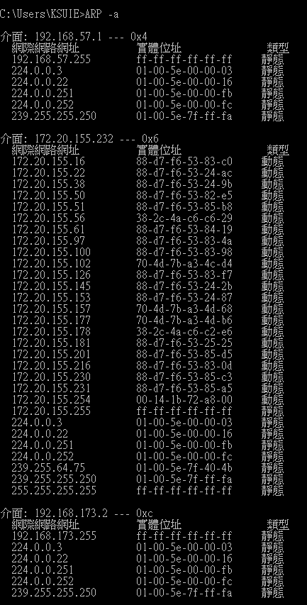

#
|| OSI Model   |        |
|| ------------| ------ | 
|7| Application | 應用層 |
|6| Presentation| 表達層 | 
|5| Session     | 會議層 | 
|4| Transport   | 傳輸層 |
|3| Network     | 網路層 |
|2| Data Link   | 連結層 |
|1| Physcial    | 實體層 |


```
Network Types: LAN, WAN, PAN, CAN, MAN, SAN, WLAN
https://www.youtube.com/watch?v=4_zSIXb7tLQ
```
```
Network Topologies (Star, Bus, Ring, Mesh, Ad hoc, Infrastructure, & Wireless Mesh Topology)
https://www.youtube.com/watch?v=zbqrNg4C98U
```

```
What is a DMZ? (Demilitarized Zone)
https://www.youtube.com/watch?v=dqlzQXo1wqo
```
```
NAT Explained - Network Address Translation
https://www.youtube.com/watch?v=FTUV0t6JaDA
```
# 網路硬體
```
Layer-1 : repeater(1-1), hub(1-N)
Layer-2 : bridgr, switch
Layer-3 : router,L3-Switch
Layer-4 : L4 switch
Layer-7 : L7 switch, proxy
```
# IEEE 802
```
● IEEE 802 指IEEE標準中關於區域網路和都會網路的一系列標準。更確切的說，IEEE 802標準僅限定在傳輸可變大小封包的網路。
  其中最廣泛使用的有乙太網路、權杖環、無線區域網路等。這一系列標準中的每一個子標準都由委員會中的一個專門工作群組負責。

● IEEE 802中定義的服務和協定限定在OSI模型的最低兩層（即實體層和資料鏈路層）。
  事實上，IEEE 802將OSI的資料鏈路層分為兩個子層，分別是邏輯鏈路控制（LLC, Logical Link Control）和媒介存取控制
 （MAC, Media Access Control），如下所示：
● 資料鏈路層
●   邏輯鏈路控制子層
●   媒介存取控制子層
● 實體層

現有標準
IEEE 802.1：高層區域網路協定（Bridging (networking) and Network Management）
IEEE 802.2：邏輯鏈路控制（Logical link control）

IEEE 802.3：乙太網路（Ethernet）
IEEE 802.4：權杖匯流排（Token bus）
IEEE 802.5：權杖環（Token-Ring）
IEEE 802.6：城域網（MAN, Metropolitan Area Network）
IEEE 802.7：寬頻TAG（Broadband LAN using Coaxial Cable）
IEEE 802.8：光纖分散式資料介面（FDDI）
IEEE 802.9：綜合業務區域網路（Integrated Services LAN）
IEEE 802.10：區域網路網路安全（Interoperable LAN Security）
IEEE 802.11：無線區域網路（Wireless LAN & Mesh）
IEEE 802.12：需求優先級（Demand priority）
IEEE 802.13：（未使用）
IEEE 802.14：電纜數據機（Cable modems）
IEEE 802.15：無線個人區域網路（Wireless PAN）
IEEE 802.15.1：無線個人區域網路絡（WPAN, Wireless Personal Area Network）
IEEE 802.15.4：低速無線個人區域網路絡（LR-WPAN, Low Rate Wireless Personal Area Network）
IEEE 802.16：寬頻無線接入（Broadband Wireless Access）
IEEE 802.17：彈性封包環傳輸技術（Resilient packet ring）
IEEE 802.18：無線電管制技術（Radio Regulatory TAG）
IEEE 802.19：共存標籤（Coexistence TAG）
IEEE 802.20：移動寬頻無線接入（Mobile Broadband Wireless Access）
IEEE 802.21：媒介獨立換手（Media Independent Handover）
IEEE 802.22：無線區域網（Wireless Regional Area Network）
IEEE 802.23：緊急服務工作群組（Emergency Services Working Group），2010年3月新發布
```
# 網路協定:

#### OSI 
```
應用層 Application 

表達層 Presentation

會議層 Session 

傳輸層

OSI Model Explained | OSI Animation | Open System Interconnection Model | OSI 7 layers | TechTerms
https://www.youtube.com/watch?v=vv4y_uOneC0
```
### ARP
```
Address Resolution Protocol (ARP) - Explained with example | Computer network | TechTerms
https://www.youtube.com/watch?v=EC1slXCT3bg

MAC Address
```
### ICMP
```
Internet Control Message Protocol

● ICMP 在溝通之中，主要是透過不同的類別( Type )與代碼( Code ) 讓機器來識別不同的連線狀況。常用的類別如下表所列﹕

類別	名稱	代表意思
0	Echo Reply	是一個回應信息。
3	Distination Unreachable	表示目的地不可到達。
4	Source Quench	當 router 負載過時﹐用來竭止來源繼續發送訊息。
5	Redirect	用來重新導向路由路徑。
8	Echo Request	請求回應訊息。
11	Time Exeeded for a Datagram	當資料封包在某些路由現象中逾時﹐告知來源該封包已被忽略忽略。
12	Parameter Problem on a Datagram	當一個 ICMP 封包重複著之前的錯誤時﹐會回覆來源主機關於參數錯誤的訊息。
13	Timestamp Request	要求對方送出時間訊息﹐用以計算路由時間的差異﹐以滿足同步性協定的要求。
14	Timestamp Replay	此訊息純粹是回應 Timestamp Request 用的。
15	Information Request	在 RARP 協定應用之前﹐此訊息是用來在開機時取得網路信息。
16	Information Reply	用以回應 Infromation Request 訊息。
17	Address Mask Request	這訊息是用來查詢子網路 mask 設定信息。
18	Address Mask Reply	回應子網路 mask 查詢訊息的。

● 在 ICMP 使用中﹐不同的類別會以不同的代碼來描述具體的狀況。以 Type 3 ( Distination Unreachable ) 為例，其下的代碼如下所列﹕

代碼	代表意思
0: Network Unreachable（無法到達目的網路）

1: Host Unreachable（無法到達目的主機）

2: Protocol Unreachable（通訊協定不存在）

3: Port Unreachable（無法到達連接埠）

4: Fragmentation Needed and DF set（資料需分割並設定不可分割位元）

5: Source Route Failed（來源路徑選擇失敗）

6: Destination Network Unknown（無法識別目的地網路）

7: Destination Host Unknown（無法識別目的地主機）

8: Source Host Isolated（來源主機被隔離）

9: Communication with Destination Network Administratively Prohibited（管理上禁止和目的地網路通訊）

10: Communication with Destination Host Administratively Prohibited（管理上禁止和目的地主機通訊）

11: Network Unreachable for Type of Service（無法到達此型態的網路服務）

12: Host Unreachable for Type of Service（無法到達此型態的主機服務）
ICMP 是個非常有用的協定﹐尤其是當我們要對網路連接狀況進行判斷的時候。下面讓我們看看常用的 ICMP 實例，以更好了解 ICMP 的功能與作用。

```
#### ICMP Message Format封包格式:


```
ICMP 封包格式，其各欄位功能如下：
● 訊息型態（Message Type）：表示該 ICMP 所欲控制之訊息型態，共有 13 種型態，訊息型態之型態代表值如表 5-2 所示。
● 編碼（Code）：對各種訊息型態進一步說明工作內容。
● 檢查集檢查碼（Checksum）：對該封包檢查集錯誤偵測。
● 訊息說明（Message description）：依照不同的控制訊息，而有不同的說明方式。
```
#### Message Type
```
ICMP 訊息功能

[重要]0  Echo Reply（回應答覆）
[重要]3  Destination Unreachable（目的地無法到達）

4 Source Quench（來源抑制）

[重要]5 Redirect（改變傳輸路徑）

[重要]8 Echo Request（回應要求）

9 Router Advertisement（路由器宣傳）
10 Router Solicitation（路由器懇請）
11 Time Exceeded for a Datagram（溢時傳輸）
12 Parameter Problem on a Datagram（參數問題）
13 Timestamp Request（時間標籤要求）
14 Timestamp Reply（時間標籤回覆）
15 Information Request（資訊要求）（停用）
16 Information Reply（資訊回覆）（停用）
17 Address Mask Request（位址遮罩要求）
18 Address Mask Reply（位址遮罩回覆）
```

```
ping 
tracert| Traceroute
(Windows tracert / Linux run)
如何使用 TRACERT 疑難排解 Windows 中的 TCP/IP 問題
https://support.microsoft.com/zh-tw/help/314868/how-to-use-tracert-to-troubleshoot-tcp-ip-problems-in-windows
```
```
tracert www.pchome.com.tw

在上限 30 個躍點上
追蹤 www.pchome.com.tw [210.59.230.39] 的路由:

  1     3 ms    <1 ms     4 ms  172.20.155.254
  2    <1 ms    <1 ms    <1 ms  172.16.190.253
  3    13 ms    <1 ms    <1 ms  120-114-151-14.ksu.edu.tw [120.114.151.14]
  4     *        *        *     要求等候逾時。
  5     *        *        *     要求等候逾時。
  6     *        *        *     要求等候逾時。
  7     *        *        *     要求等候逾時。
  8     *        *        *     要求等候逾時。
  9     *        *        *     要求等候逾時。
 10     *        *        *     要求等候逾時。
```
```
在上限 30 個躍點上
追蹤 www.ksu.edu.tw [120.114.100.65] 的路由:

  1    <1 ms    <1 ms    <1 ms  172.20.155.254
  2    <1 ms    <1 ms    <1 ms  120-114-50-230.ksu.edu.tw [120.114.50.230]
  3    <1 ms    <1 ms    <1 ms  chs.www.ksu.edu.tw [120.114.100.65]

追蹤完成。
```
#### tracert ksu 
```

```
### TCP vs UDP 
```
TCP vs UDP Comparison
https://www.youtube.com/watch?v=uwoD5YsGACg
```


### SSL, TLS, HTTP, HTTPS 
```
SSL, TLS, HTTP, HTTPS Explained
https://www.youtube.com/watch?v=hExRDVZHhig
```

###  Proxy Server
```
What is a Proxy Server?
https://www.youtube.com/watch?v=5cPIukqXe5w
```

### FTP (File Transfer Protocol), SFTP, TFTP Explained.
```
FTP (File Transfer Protocol), SFTP, TFTP Explained.
https://www.youtube.com/watch?v=tOj8MSEIbfA
```
# RFID
```
無線射頻辨識（英語：Radio Frequency IDentification，縮寫：RFID）是一種無線通訊技術，可以通過無線電訊號識別特定目標並讀寫相關數據，而無需識別系統與特定目標之間建立機械或者光學接觸。
```
# TCP
```
● 可靠性 : 能夠確保資料完整的傳輸，確認是否有接收到，封包格式確認，回傳確認(三項交握)
● 不可靠性 : 傳輸過去的資料不管有沒有正確都不會再次確認、回傳(很小的影響或可接性)
```
#### TCP Format
```

```
# 不可靠的unreliable UDP
```
不可靠的unreliable UDP
https://en.wikipedia.org/wiki/User_Datagram_Protocol


許多關鍵的網際網路應用程式使用UDP，包括：
域名系統（DNS），其中查詢階段必須快速，並且只包含單個請求，後跟單個回覆封包；
動態主機組態協定（DHCP），用於動態分配IP位址；
簡單網路管理協定（SNMP）；
路由資訊協定（RIP）。

● UDP構建可靠資料傳輸
  簡單來講，要使用UDP來構建可靠的面向連線的資料傳輸，就要實現類似於TCP協議的超時重傳，有序接受，應答確認，滑動視窗流量控制等機制，等於說要在傳輸層的   上一層（或者直接在應用層）實現TCP協議的可靠資料傳輸機制，比如使用UDP資料包+序列號，UDP資料包+時間戳等方法，在伺服器端進行應答確認機制，這樣就會保證   不可靠的UDP協議進行可靠的資料傳輸。

● UDT（UDP-based Data Transfer Protocol）
  基於UDP的資料傳輸協議（UDP-based Data Transfer Protocol，簡稱UDT）是一種網際網路資料傳輸協議。UDT的主要目的是支援高速廣域網上的海量資料傳輸，而   網際網路上的標準資料傳輸協議TCP在高頻寬長距離網路上效能很差。 顧名思義，UDT建於UDP之上，並引入新的擁塞控制和資料可靠性控制機制。UDT是面向連線的雙向   的應用層協議。它同時支援可靠的資料流傳輸和部分可靠的資料報傳輸。 由於UDT完全在UDP上實現，它也可以應用在除了高速資料傳輸之外的其它應用領域，例如點到   點技術（P2P），防火牆穿透，多媒體資料傳輸等等。
  UDT是雙工的，每個UDT實體有兩個部分：傳送和接收。傳送者根據流量控制和速率控制來發送（和重傳）應用程式資料。接收者接收資料包和控制包，並根據接收到的   包傳送控制包。傳送和接收程式共享同一個UDP埠來發送和接收。
```
```
UDP Format
UDP報頭包括4個欄位，每個欄位占用2個位元組（即16個位元）。
在IPv4中，「來源連接埠」和「校驗和」是可選欄位（以粉色背景標出）。
在IPv6中，只有來源連接埠是可選欄位。 
各16bit的來源埠和目的埠用來標記傳送和接受的應用行程。

UDP不需要應答，所以來源埠是可選的，如果來源埠不用，那麼置為零。
在目的埠後面是長度固定的以位元組為單位的長度域，用來指定UDP資料報包括資料部分的長度，長度最小值為8byte。
首部剩下地16bit是用來對首部和資料部分一起做校驗和（Checksum）的，這部分是可選的，
但在實際應用中一般都使用這一功能。

[3]報文長度
該欄位指定UDP報頭和資料總共占用的長度。
可能的最小長度是8位元組，因為UDP報頭已經占用了8位元組。
由於這個欄位的存在，UDP報文總長不可能超過65535位元組（包括8位元組的報頭，和65527位元組的資料）。
實際上通過IPv4協定傳輸時，由於IPv4的頭部資訊要占用20位元組，因此資料長度不可能超過65507位元組
               （65,535 − 8位元組UDP報頭 − 20位元組IP頭部）。
在IPv6的jumbogram中，是有可能傳輸超過65535位元組的UDP封包的。
依據RFC 2675，如果這種情況發生，報文長度應被填寫為0。


[4]校驗和checksum
校驗和欄位可以用於發現頭部資訊和資料中的傳輸錯誤。
該欄位在IPv4中是可選的，在IPv6中則是強制的。
如果不使用校驗和，該欄位應被填充為全0。
```
### DNS
```

```

### DNS
```

```

### DNS
```

```
#### ARP
```
C:\Users\KSUIE>ARP -a

介面: 192.168.57.1 --- 0x4
  網際網路網址          實體位址               類型
  192.168.57.255        ff-ff-ff-ff-ff-ff     靜態
  224.0.0.3             01-00-5e-00-00-03     靜態
  224.0.0.22            01-00-5e-00-00-16     靜態
  224.0.0.251           01-00-5e-00-00-fb     靜態
  224.0.0.252           01-00-5e-00-00-fc     靜態
  239.255.255.250       01-00-5e-7f-ff-fa     靜態

介面: 172.20.155.232 --- 0x6
  網際網路網址          實體位址               類型
  172.20.155.16         88-d7-f6-53-83-c0     動態
  172.20.155.22         88-d7-f6-53-24-ac     動態
  172.20.155.38         88-d7-f6-53-24-9b     動態
  172.20.155.50         88-d7-f6-53-82-e5     動態
  172.20.155.51         88-d7-f6-53-85-b8     動態
  172.20.155.56         38-2c-4a-c6-c6-29     動態
  172.20.155.61         88-d7-f6-53-84-19     動態
  172.20.155.97         88-d7-f6-53-83-4a     動態
  172.20.155.100        88-d7-f6-53-83-98     動態
  172.20.155.102        70-4d-7b-a3-4c-d4     動態
  172.20.155.126        88-d7-f6-53-83-f7     動態
  172.20.155.145        88-d7-f6-53-24-2b     動態
  172.20.155.153        88-d7-f6-53-24-87     動態
  172.20.155.157        70-4d-7b-a3-4d-68     動態
  172.20.155.177        70-4d-7b-a3-4d-b6     動態
  172.20.155.178        38-2c-4a-c6-c2-e6     動態
  172.20.155.181        88-d7-f6-53-25-25     動態
  172.20.155.201        88-d7-f6-53-85-d5     動態
  172.20.155.216        88-d7-f6-53-83-0d     動態
  172.20.155.230        88-d7-f6-53-85-c3     動態
  172.20.155.231        88-d7-f6-53-85-a5     動態
  172.20.155.254        00-14-1b-72-a8-00     動態
  172.20.155.255        ff-ff-ff-ff-ff-ff     靜態
  224.0.0.3             01-00-5e-00-00-03     靜態
  224.0.0.22            01-00-5e-00-00-16     靜態
  224.0.0.251           01-00-5e-00-00-fb     靜態
  224.0.0.252           01-00-5e-00-00-fc     靜態
  239.255.64.75         01-00-5e-7f-40-4b     靜態
  239.255.255.250       01-00-5e-7f-ff-fa     靜態
  255.255.255.255       ff-ff-ff-ff-ff-ff     靜態

介面: 192.168.173.2 --- 0xc
  網際網路網址          實體位址               類型
  192.168.173.255       ff-ff-ff-ff-ff-ff     靜態
  224.0.0.3             01-00-5e-00-00-03     靜態
  224.0.0.22            01-00-5e-00-00-16     靜態
  224.0.0.251           01-00-5e-00-00-fb     靜態
  224.0.0.252           01-00-5e-00-00-fc     靜態
  239.255.255.250       01-00-5e-7f-ff-fa     靜態
```
```


